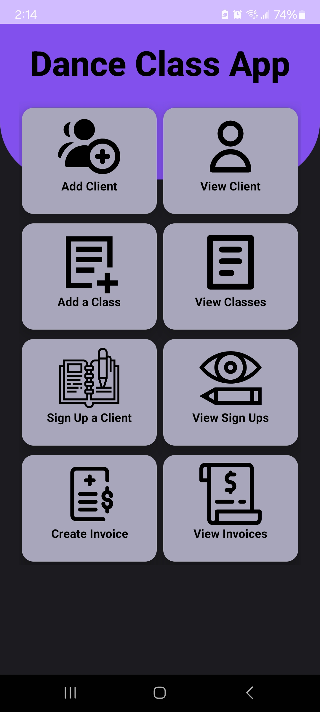
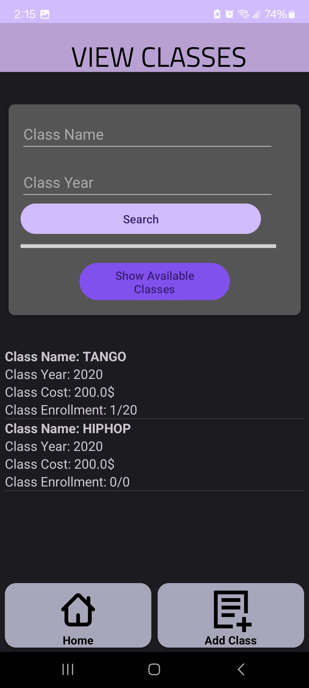
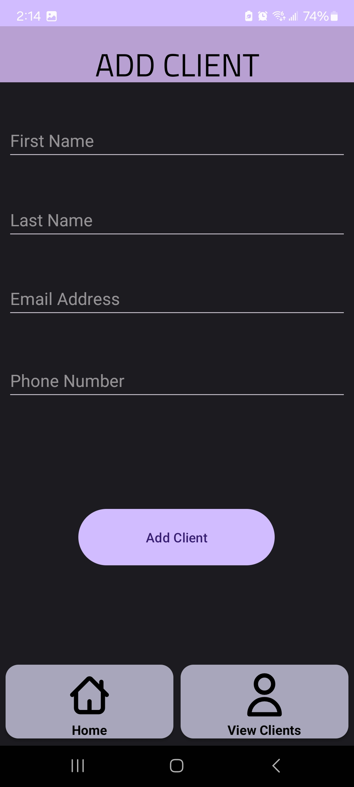

📱 Mobile Invoice App – Dance Class Client (School Project)
🧑‍💻 Team Members
Desmond Stular – des267

Andrew Bartko – andrewbartkomacewan

Gabriel Jorand – G4BR13LJ

Brendan Ure – Ure-B

  

📚 About the Project
This project was developed as part of a university-level mobile development course.
The Mobile Invoice App is a proof-of-concept (demo) designed for dance class businesses to manage clients, courses, invoices, and sign-ups.
It was built using Android Studio with a local SQL database (SQLite) to demonstrate full-stack mobile CRUD operations.

The app's backend layer was extensively developed to support multiple entities, allowing seamless management of:

Clients

Courses

Invoices

Course Sign-ups

This project showcases practical application of Android fundamentals, database integration, and full CRUD functionality within a polished, mobile-friendly UI.

✨ Features
- Client Management — Add, edit, delete, and view client profiles.

- Course Management — Set up and manage available dance courses.

- Invoice Generation — Create and track invoices for client enrollments.

- Sign-up Tracking — Record and manage client sign-ups for classes.

- Search Functionality — Quickly search clients, courses, and invoices.

- SQLite Backend — Built-in database to persist all user and class data.

- Responsive UI — Designed with Android Studio’s XML layout system.

🖼️ Screenshots

  
 
  

⚙️ Technical Overview
Platform: Android (Java / Android SDK)

Database: Local SQLite (Android built-in SQL database)

Architecture:

Custom Java classes to handle all major entities (Client, Course, Invoice, SignUp).

Direct database interaction via helper classes.

Full CRUD (Create, Read, Update, Delete) support for all major entities.

Purpose:

Academic demonstration of mobile app backend integration and custom UI design.

Serve as a foundational framework for a more robust invoicing application in the future.
